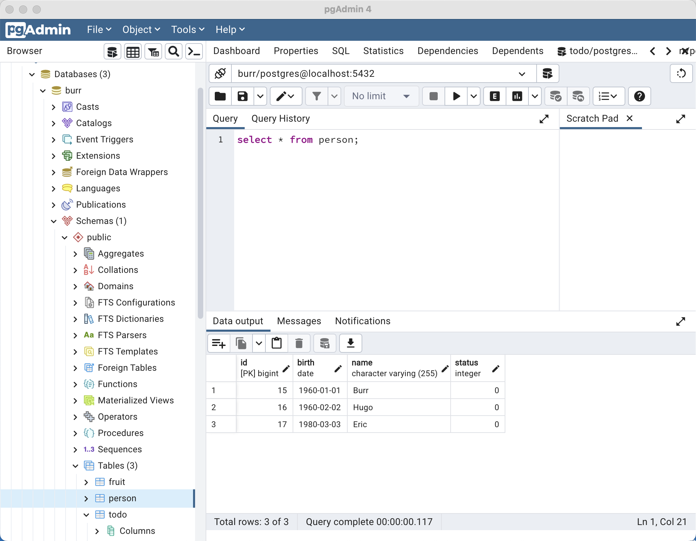

# Skupper Gateway

Allowing a remote Azure Kubernetes cluster to connect back into the on-premises/laptop's local microservice and database.

A migration to a public cloud provider does not have to be an all-or-nothing scenario.  Skupper allows exposing of on-premises services (e.g. databases, applications) out to a remote Kubernetes cluster.  

You can also leverage Quarkus's live reload coding feature or debugger while remote  Kubernetes hosted pods are interacting with your local microservices.


## Pre-reqs

### Skills

Assumes you are highly skilled at Kubernetes and fairly skilled at running Java applications as well as a Postgres database

### Tools on the laptop

```
kubectl
```

```
skupper
```


```
docker 
```

I am using Docker Desktop


## On Cluster (KUBECONFIG)

This creates an AKS in Japan but any OpenShift or Kubernetes cluster would work

```
export KUBECONFIG=/Users/burr/xKS/.kubeconfig/aks-tokyo-config

az login

az group create --name myAKSTokyoResourceGroup --location japaneast

az aks create --resource-group myAKSTokyoResourceGroup --name tokyo -s Standard_DS3_v2 --node-count 2
```

```
az aks get-credentials --resource-group myAKSTokyoResourceGroup --name tokyo --file $KUBECONFIG --overwrite
```

```
kubectl get nodes
NAME                                STATUS   ROLES   AGE     VERSION
aks-nodepool1-11151165-vmss000000   Ready    agent   7m32s   v1.22.11
aks-nodepool1-11151165-vmss000001   Ready    agent   7m30s   v1.22.11
```

```
kubectl create namespace hybrid
kubectl config set-context --current --namespace=hybrid
```

```
skupper version
client version                 1.0.2
```


```
skupper init
```

```
kubectl get services
NAME                   TYPE           CLUSTER-IP     EXTERNAL-IP     PORT(S)                           AGE
skupper                LoadBalancer   10.0.252.120   20.89.189.119   8080:31920/TCP,8081:31912/TCP     25s
skupper-router         LoadBalancer   10.0.208.189   20.89.187.138   55671:31311/TCP,45671:31132/TCP   37s
skupper-router-local   ClusterIP      10.0.189.166   <none>          5671/TCP                          38s
```

```
skupper status
Skupper is enabled for namespace "hybrid" in interior mode. It is not connected to any other sites. It has no exposed services.
The site console url is:  https://20.89.189.119:8080
The credentials for internal console-auth mode are held in secret: 'skupper-console-users'
```

## Expose laptop services

Create the configuration/definition file to define which services will be exposed to the overall Skupper network

```
cat <<EOF >  localhost-services.yaml
name: localhost-services 
bindings:
    - name: db 
      host: host.docker.internal 
      service:
        address: localhost-db:5432 
        protocol: tcp 
        ports:
           - 5432 
      target_ports:
           - 5432 
    - name: java
      host: host.docker.internal
      service:
        address: localhost-java:8080
        protocol: http
        ports:
           - 8080
      target_ports:
           - 8080
qdr-listeners:
    - name: amqp
      host: localhost
      port: 5672
EOF
```

```
docker ps
CONTAINER ID   IMAGE     COMMAND   CREATED   STATUS    PORTS     NAMES
```


Note: Alternative `skupper gateway init --config localhost-services.yaml --type docker` but it currently does not work with http endpoints


```
mkdir -p bundle/localhost-services
```

```
skupper gateway generate-bundle localhost-services.yaml ./bundle/localhost-services
```

If the bundle file was on another machine, get it onto your laptop/on-premises server

```
mkdir gateway

tar -xvf ./bundle/localhost-services/localhost-services.tar.gz --directory gateway

cd gateway

chmod +x *.sh
```

```
./launch.sh -t docker
```

```
docker ps
CONTAINER ID   IMAGE                                  COMMAND                  CREATED         STATUS         PORTS     NAMES
e98e8c3681e3   quay.io/skupper/skupper-router:2.0.2   "/home/skrouterd/bin…"   6 seconds ago   Up 5 seconds             localhost-services
```

Create the "proxy" Kubernetes Services that will actually be implmented on-premises

```
skupper service create localhost-db 5432
skupper service create localhost-java 8080 --mapping http
```

```
kubectl get services 
NAME                   TYPE           CLUSTER-IP     EXTERNAL-IP     PORT(S)                           AGE
localhost-db           ClusterIP      10.0.7.121     <none>          5432/TCP                          12s
localhost-java         ClusterIP      10.0.129.218   <none>          8080/TCP                          7s
skupper                LoadBalancer   10.0.252.120   20.89.189.119   8080:31920/TCP,8081:31912/TCP     4m21s
skupper-router         LoadBalancer   10.0.208.189   20.89.187.138   55671:31311/TCP,45671:31132/TCP   4m33s
skupper-router-local   ClusterIP      10.0.189.166   <none>          5671/TCP                          4m34s
```

```
skupper status
Skupper is enabled for namespace "hybrid" in interior mode. It is connected to 1 other site. It has 2 exposed services.
The site console url is:  https://20.89.191.135:8080
The credentials for internal console-auth mode are held in secret: 'skupper-console-users'
```

```
skupper service status
Services exposed through Skupper:
├─ localhost-db (tcp port 5432)
╰─ localhost-java (http port 8080)
```

## On-premises/laptop

Start up your favorite Quarkus, Spring Boot or whatever app on port 8080

```
git clone https://github.com/burrsutter/skupper-gateway

cd skupper-gateway/pgcrud

mvn quarkus:dev
```

```
curl localhost:8080/stuff
```

```
Stuff: 1
```


## On Cluster Tests

```
kubectl exec -it deploy/skupper-router -c router -- bash
```

```
curl localhost-java:8080/hello
Hello from RESTEasy Reactive
```


```
curl localhost-java:8080/stuff
Stuff: 1
```

```
curl localhost-java:8080/stuff/add
Added Records
```

```
kubectl exec -it deploy/psql -- sh
```

```
psql
\l
\dt
select * from person;
```

```
 id |   birth    | name | status
----+------------+------+--------
  3 | 1970-01-01 | Burr |      0
  4 | 1980-02-02 | Hugo |      0
  5 | 1990-03-03 | Eric |      0
(3 rows)
```


## On-premises/laptop




## On Cluster


## On-premises Clean up

```
./remove.sh -t docker

rm -rf gateway
```

## On Cluster Clean up

```
skupper delete service localhost-db
skupper delete service localhost-java
```

```
skupper gateway delete
```

```
rm -rf ~/.local/share/skupper
```

```
rm -rf bundle/
rm -rf gateway/
```


```
az aks delete --resource-group myAKSTokyoResourceGroup --name tokyo
```


