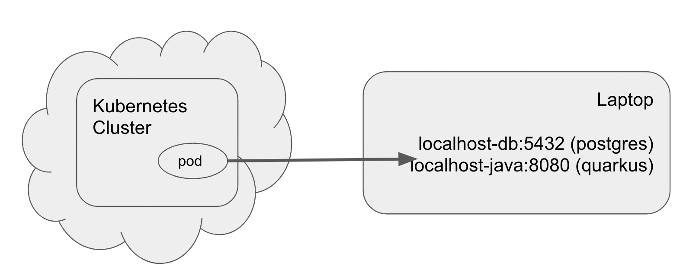

# Skupper Gateway

Allowing a remote Azure Kubernetes cluster to connect back into the laptop's local microservice and on-premises database.

A migration to a public cloud provider does not have to be an all-or-nothing scenario.  Skupper allows exposing on-premises services (e.g. databases, applications) out to a remote Kubernetes cluster.  

You can also leverage Quarkus's live reload coding feature or debugger while remote additional Kubernetes hosted pods are interacting with your local version of another microservice.




## On Cluster (KUBECONFIG)

This creates an AKS in Japan but any OpenShift or Kubernetes cluster would work

```
export KUBECONFIG=/Users/burr/xKS/.kubeconfig/aks-tokyo-config

az login

az group create --name myAKSTokyoResourceGroup --location japaneast

az aks create --resource-group myAKSTokyoResourceGroup --name tokyo -s Standard_DS3_v2 --node-count 2
```

```
az aks get-credentials --resource-group myAKSTokyoResourceGroup --name tokyo --file $KUBECONFIG
```

```
kubectl create namespace hybrid
kubectl config set-context --current --namespace=hybrid

```

```
skupper version
client version                 1.0.2
```


```
skupper init
```

Create the "proxy" Kubernetes Services that will actually be implmented on-premises

```
skupper service create localhost-db 5432
skupper service create localhost-java 8080 --mapping http
```

```
kubectl get services 
NAME                   TYPE           CLUSTER-IP     EXTERNAL-IP     PORT(S)                           AGE
localhost-db           ClusterIP      10.0.206.197   <none>          5432/TCP                          101m
localhost-java         ClusterIP      10.0.149.105   <none>          8080/TCP                          101m
skupper                LoadBalancer   10.0.57.243    20.89.191.135   8080:32324/TCP,8081:32516/TCP     122m
skupper-router         LoadBalancer   10.0.28.159    20.89.189.135   55671:30785/TCP,45671:30239/TCP   122m
skupper-router-local   ClusterIP      10.0.31.114    <none>          5671/TCP                          122m
```

```
skupper status
Skupper is enabled for namespace "hybrid" in interior mode. It is connected to 1 other site. It has 2 exposed services.
The site console url is:  https://20.89.191.135:8080
The credentials for internal console-auth mode are held in secret: 'skupper-console-users'
```

```
skupper service status
Services exposed through Skupper:
├─ localhost-db (tcp port 5432)
╰─ localhost-java (http port 8080)
```

Create the configuration/definition file to define which services will be re-routed

```
cat <<EOF >>  localhost-services.yaml
name: localhost-services 
bindings:
    - name: db 
      host: host.docker.internal 
      service:
        address: localhost-db:5432 
        protocol: tcp 
        ports:
            - 5432 
      target_ports:
        - 5432 
    - name: java
      host: host.docker.internal
      service:
        address: localhost-java:8080
        protocol: http
        ports:
           - 8080
        target_ports:
           - 8080
qdr-listeners:
    - name: amqp
      host: localhost
      port: 5672
EOF
```

```
mkdir -p bundle/localhost-services
```

```
skupper gateway generate-bundle localhost-services.yaml ./bundle/localhost-services
```

## On-premises/laptop (no KUBECONFIG)

If the bundle file was on another machine, get it onto your laptop/on-premises server :-)

```
mkdir gateway

tar -xvf ./bundle/localhost-services/localhost-services.tar.gz --directory gateway

cd gateway

chmod +x *.sh
```

```
./launch.sh -t docker
```

## On-premises/laptop

Start up your favorite Quarkus, Spring Boot or whatever app on port 8080

```
git clone https://github.com/burrsutter/skupper-gateway

cd skupper-gateway/pgcrud

mvn quarkus:dev
```

## On Cluster Java test

```
kubectl exec -it deploy/skupper-router -c router -- bash
```

```
curl localhost-java:8080/hello
Hello from RESTEasy Reactive
```


```
curl localhost-java:8080/stuff
Stuff: 1
```

```
curl localhost-java:8080/stuff/add
Added:3
```

## On laptop


## On-premises Clean up

```
./remove.sh -t docker

rm -rf gateway
```

## On Cluster Clean up

```
skupper delete service localhost-db
skupper delete service localhost-java
```

```
az aks delete --resource-group myAKSTokyoResourceGroup --name tokyo
```
